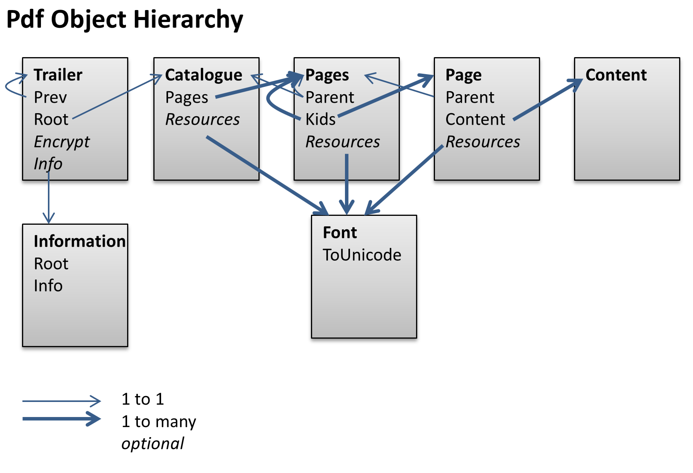
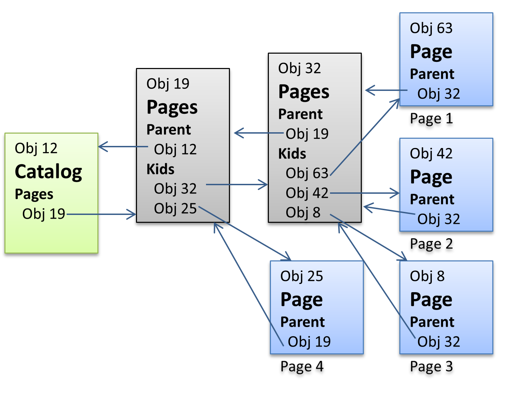
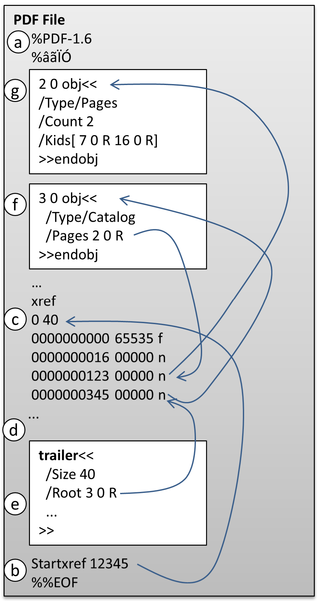
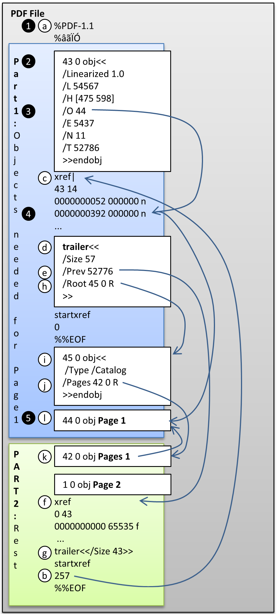

All you need to extract text from a pdf file (C#, public domain)

# PDf File Format explained for text extraction
The pdf specification is complicated, difficult to read and very long, 756 pages. This 
text here gives a brief overview over the aspects relevant for 
text extraction. This helps to understand how the provided software works and it will 
be easier for you to read the actual specification 
[PDF 32000-1:2008 First Edition2008-7-1 Document management Portable document format ó Part 1: PDF 1.7](https://www.adobe.com/content/dam/acom/en/devnet/pdf/pdfs/PDF32000_2008.pdf)
which is publicly available. There is a newer ISO specification, but I am not going 
spend over 100 USD just to read it. I feel it is crazy that an international standard 
is not freely available.

## PDF Object
In order to understand the structure of a pdf file, it helps to have a look first 
at its building blocks, the pdf objects. Please note that only elements related to text 
extractions are explained, there are many more, for example elements to draw graphics.

The first pdf specification was written in the last century. Compared 
to a C# specification, pdf is rather unprecise and confusing. This shows 
when it comes to objects. It starts reasonably well that it calls numbers, strings 
and arrays as objects. A pdf file can be 
opened by any text editor and some content might look like this: (note that in pdf, a '%' starts a 
**Comment**, anything that follows gets discarded until the end of line):

```
true % boolean
123 % integer number
-4.56 % real number
(this is a string)
<A1B2C3> % hexadecimal string, can have any byte value
/Name % can be used for example to define the key value in a dictionary
[1 (one) 1.1 true] % an array, can contain a mix of any other object

```

There are 2 more objects, **Dictionary** and **Stream**, which are described further down.

### Indirect Object

An **Indirect Object** can look like this:

```
42 0 obj
123
endobj
```

Here, the number '123' is wrapped with an identifier (line 1) and ends with 'endobj' 
on line 3.
'42' is the **object number** and '0' is the **generation number**. The combination of the
two gives the encapsulated object an unique **ObjectId**. Other object can link to this 
number '123' by using it's *ObjectId*. At the end of a pdf file is a **cross reference table** 
listing for each *ObjectId* its location as byte offset from the beginning of the file. 

### Dictionary
When it comes to pdf specific elements, like a page, they 
are not objects in their own rights, but actually what pdf calls a **Dictionary**.

A pdf dictionary is a bit like an *Dictionary* in C#, it has keys and each key value
can be used to access one pdf object, i.e. number, string, collection or another dictionary. The 
difference to a c# *Dictionary* is that the possible key values are fixed for a particular 
dictionary type.

Let's look at **Document Information Dictionary** as an example: 
```
2 0 obj
<<
 /Title (Document)
 /Producer (Rendering Engine 7.0M2p0047)
>>
endobj
```

The first line is the identifier of the dictionary and the text between << and >> 
defines the actual content of that dictionary. In JSON, the content would look 
like this:

```
{
 "Title"="Document"
 "Producer" = "Rendering Engine 7.0M2p0047"
}
```

Pdf assumes that whoever access *2 0 obj* knows already that it is actually a 
*Document Information Dictionary*, which can only have the following key values:
Title, Author, Subject, Keywords, Creator, Producer, CreationDate, ModDate, Trapped.

In the following text, the word **object** is used to mean a pdf dictionary which has 
a particular purpose, like storing the information of a page. The 
**property** names are actually the allowed key values for that dictionary.

A *Dictionary* might have a **Type** property, which indicates for what 
this dictionary is used for. So an object called **Page Tree Node** has a *Type* with 
the value **Pages**. In this documentation, we use these *Type* values to indicate which
object is meant. However, one of the many flaws of the pdf specification is that a 
*Dictionary* doesn't need to have a *Type* property and one has to use the context
to figure out what the function of that dictionary might be.   




### Trailer
It is the root object from which all other objects in a pdf file can be reached. See PDF File 
structure how it can be found. A **Trailer** has many properties, most will not 
be mentioned here. 

For text extractions the property **Root** is important, which links to the **Catalog** 
object, the root of all pages. Pdf is page oriented with limitted space per 
page, as opposed to HTML, which can display content unlimitted in width or length.

The *Trailer* property **Encrypt** holds a link to the optional **Encrypt** object, where all encryption 
related information is stored. The **Info** property links to general information about 
the document stored in the optional object *Document Information Dictionary*. 

### Catalog
There is one *Catalog* object in a pdf document. It's **Pages** property holds the root 
of the page tree, a *Page Tree Node* object where the *Type* property has the value 
 **Pages**. A *catalog* has many other properties 
which are not relevant for text extractions.

### Page Tree (Pages and Page)
A **Page Tree** is not an object, but a description how the actual objects *Pages* and 
**Page** can be organised as a tree:



The *Page Tree* starts with a root *Page Tree Node* having the type *Pages*. A *Page Tree Node* 
can contain in its **Kids** properties links to *Page Tree Nodes* and *Page Objects* with the 
type *Page*.

*Pages* and *Page* have the properties:
- **Parent** linking back down the tree to another *Pages* or *Catalog*. 
- **Resources** linking to objects like **Font** and others, which are not relevant for text 
retrieval. If a page content needs a specific font, but it cannot be found in the page's
*Resources* property, one has to travel down the tree from parent to parent until the
font is found in one of the parent's *Resources* properties.

*Page* has an additional property called **Content** which can contain several links 
to **streams** containing the actual text of part of a page. A *stream* is usually 
encoded to save storage space. While it is possible to inspect the strucuture of 
a pdf file with any editor, to see the actual content of the streams one needs a 
program like the *PdfFilesTextBrowser* provided in this project.

### Stream
A **Stream** basically is a very long string which can be compressed. While the rest of a 
pdf document uses only ASCII characters, a stream can contain any byte value. 

```
72 0 obj
<<
/Subtype/Type1C
/Filter/FlateDecode
/Length 132
>>
stream
ú,Q¨qË,´A|ã˙àÃ1KKÔ◊
Iή[fl|Do"c÷aGÄ_‚_ñ
ÆrU…c≥K„5;6Bi⁄¨eV§◊àÑ1—§(®+îÈ æ¿®˙ @Ï@fâÏ2äx¥˛:˙|dU‡bÚ'^Ëhµ 
r}◊wuHÔ’‰≠è´ï‘_∞P1
endstream
endobj
```
The outmost part of a stream is an object starting with the line containing 'obj' and ending at
'endobj'. The object contains a dictionary starting at '<<' and ending at '>>'. The 
dictionary has information like what kind of encoding is used (FlateDecode) and how many 
bytes are encoded. The *Stream* starts with 'stream' andd ends with 'endstream'. 

Since the 
bytes in the stream might contain by chance the values of 'endstream' somewhere, it cannot 
be used to detect the end of the stream. Instead, **Length** indicates how many encoded 
bytes there are. Now the challenge is, where exactly does the counting of the first byte 
start ? Sounds simple, but the pdf specification managed to make a mess even here. The 
problem is that Windows
uses *carriage return* and *line feed* (2 characters) to mark the end of a line, while Unix uses 
just a *line feed* (1 character). So the specification states that the counting starts after the *line feed* 
which might be preceeded by a *carriage return*. 

So far so good. But in reality, there are 
some writers which just use *carriage return* to end a line, which is allowed in any other 
line except after 'stream'. Unfortunately, there are writers out there using only carriage 
returns everywhere, also after 'stream'. A clear violation of the specification and 
troublesome, 
because if in such a *carriage return* only file the very first character is by chance a *line 
feed*, most readers might skip it, even it is probably an encoded byte. The correct 
thing to do would be to reject such a file, 
but no, Acrobat Reader just reads it fine. Meaning our reading software needs to deal with 
these malformed files too. What a mess, that could have been easily prevented by allowing 
only 'line feed' to terminate and line.

Decoding the bytes should be simple, but unfortunately the .NET **DeflateStream** class follows 
RFC1951 and pdf follows RFC1950. To use *DeflateStream*, one has to simply skip the first 2 
bytes.


## PDF File Structure
### File Header
A pdf file contains very little information at its beginning:
```pdf
%PDF-1.4
%‚„œ”
1 0 obj
```
'%' marks normally the start of a comment. Of course, 'PDF-1.4' is not a comment 
but tells the reader which pdf version is used.
The second line also pretends to be a comment. Most characters in a pdf document 
which are not part of a *stream* are ASCCI. The second 
line must contain any 4 characters with character codes greater 127 so that a 
file transfer application knows it has to transmit 8 and not 7 bits per character. 
This last century garbage is still part of every pdf file.

### File End
In order to understand the complicated pdf file structure, one has to remember 
that in the last century a PC might have not had enough RAM to store a complete 
pdf file. So a pdf writer must be able to write pdf objects in any sequence 
and a *cross reference table* then lists the start address of every object. Following 
the *cross reference table* is the *Trailer* object as described above. It's *Root* property 
links to the *Catalog* object which links to all information needed to display all 
pages of the document. 

```pdf
xref
0 74
0000000000 65535 f
0000000016 00000 n
0000050772 00000 n
...
0000067611 00000 n
0000067831 00000 n
trailer
<<
/Size 74
/Root 73 0 R
/Info 63 0 R
>>
startxref
67964
%%EOF
```
Basically, a reader starts at the end of the file, verifies that '%%EOF' marks 
the end of the file, then searches backwards until it has found 'startxref'. The 
following byte offset points to the beginning of the *cross reference table* which is marked with 
the letters 'xref'. The following value range 0..74 shows that there are 74 entries
with the ID starting at 0. 

This should be followed by exactly 74 lines, each line with excat the same width. Line 
0 contains the information for object 0, which is never user, line 1 object 1 and 
so one. The first column shows the start address as byte offset from the beginning 
of the file. 

The second number is the object's *generation number*, another feature that complicates 
pdf unnecessarily. Basically, the same *object number* can be reused for a new object if the 
present object is no longer needed. The new object will have the same *object number*, 
but its *generation number* is incremented by one. The third column with the letters are 
unimportant for text extractions.

According to this index, the object with the ID 1 starts at byte offset 16.

The index table is followed by the *Trailer*, which is already described. Note 
that the property **Size** says there will be 74 entries in the 
*cross reference table*. In a simple file this information is redundant, but more complex 
files can contain several *cross reference tables* and *Size* indicates how many entries 
there will be in total.

```
/Root 73 0 R
```

The *Root* property shows how a link to an object looks like in a pdf file. The
*ObjectId* of an object consists of 2 numbers: *object number* and *generation number*. 'R' 
completes the link notion. If there are 2 different objects in a pdf file with 
the same *object number*, only the one with the highest *generation number* should be in 
use. A bad idea in my maybe not so 
humble oppinion and it makes reading a pdf file REALLY complicated. But wait, it's soon 
getting way more complicated.

## Finding the Page Tree in a simple file


a) At the head of the file read the pdf version
b) At the end of the file read the byte offset of the *cross reference table* after 'startxref'
c) Read the *cross reference table* after xref
d) Read the *Trailer* object
e) Get the *ObjetID* of the *Catalog* from *Trailer*.*Root*
f) Use that *ObjetID.Object Number* as offset into the *cross reference table* to get the byte offset of *Catalog*
g) Read the *Catalog* object
h) Get the *ObjetID* of the page tree root *Pages* from *Catalog*.*Pages* 
i) Use that *ObjetID.Object Number* as offset into the *cross reference table* to get the byte offset of *Pages*
j) You have found the root of the *Page Tree*

## Reading a linearized pdf File
Having to start reading a pdf file from its end could cause a problem when downloading 
files over the slow internet (dial up modem) of the last century. Rather soon the 
specification got updated that it is also possible to have all the information needed 
to display the first page right at the beginning of the file, which is called a 
**Linearized PDF**:



A linearized pdf files has 2 parts:
1) Contains all objects needed to present page 1 to the user.
2) Contains all other objects which are not needed to present page 1 to the user.

There are 2 ways to read a linearized pdf. The first one starts at the beginning:
1) At the head of the file read the pdf version
2) Check if the first object is a **Linearization Parameter Dictionary**. It can be recorgnised by its **Linearized** property.
3) The **O** property contains the *Objet Number* of the first page.
4) Search for 'xref' after the *Linearization Parameter Dictionary*. In this example, the second entry is for *object number* 43, showing the byte offset for page 1.
5) The object for page 1 is found.

The pdf specification tries to be backward compatible, meaning a reader not supporting 
pdf linearization can still start reading at the end of the file, what the PdfReader in this 
project does:
a) At the head of the file read the pdf version.
b) At the end of the file read the byte offset of the *cross reference table* after 'startxref'.
c) Read the *cross reference table*. Note that it is the one at the beginning of the file.
d) Read the *Trailer* object. This is also at the beginning of the file.
e) *Trailer*.**Prev** has a byte offset to the second *cross reference table*. 
f) The second *cross reference table* contains the bytes offsets for the objects 0 .. 42
g) Read the second *Trailer* after second *cross reference table*. This second *Trailer* is empty.
h) Continue processing the first trailer. Its property *Root* contains the *ObjectId* of *Catalog*. It's byte offset can be found in the first *cross reference table*.
i) Read the *Catalog* object.
j) Get the *ObjetID* for the page tree root *Pages* from *Catalog*.*Pages*. 
k) Get the *ObjetID* for the page 1 from *Pages*.*Kids*. 
k) You have found page 1.

## Cross-Reference Stream
If you think this is complicated, the pdf specification found a way 
to make it even worse. They realised that the cross reference tables can take up a lot 
of space (over 100'000 lines or 2MBytes for the *PDF Specification* !!!), so they decided that it can 
also be placed into a **Cross-Reference Stream**.


## Fonts
some hints where character names might get found:
"Adobe Character Index"
"PostScript character name"
"parenleft.case" means parenthesis left for upper case

**9.6.6.2 Encodings for Type 1 Fonts**

A Type 1 font programís glyph descriptions are keyed by glyph
names, not by character codes. Glyph names are ordinary PDF name objects. 
Descriptions of Latin alphabetic characters are normally associated with names 
consisting of single letters, such as A  or a. Other characters are 
associated with names composed of words, such as three, ampersand, or 
parenleft. A Type 1 fontís built-in encoding shall be defined by an Encoding 
array that is part of the font program, not to be confused with the Encoding 
entry in the PDF font dictionary. 

An Encoding entry may override a Type 1 
fontís mapping from character codes to character names. The Differences array 
may map a code to the name of any glyph description that exists in the font 
program, regardless of whether that glyph is referenced by the fontís built-in 
encoding or by the encoding specified in the BaseEncoding entry. | 

