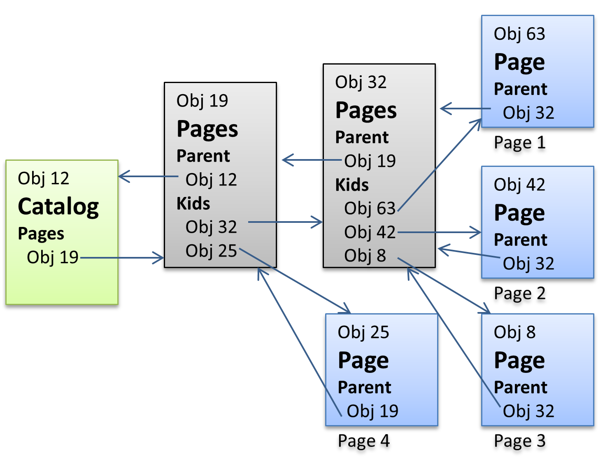

All you need to extract text from a pdf file

# PDf File Format explained for text extraction

## PDf Object Hierachy
In order to understand the structure of a pdf file, it helps to have a look first 
at object hierarchy. Please note that only objects related to text extractions are 
explained, there are many more, for example objects to draw graphics.

### "Objects" in PDF
The first pdf specification was written in the last century and it shows. Compared 
to a C# specification, pdf is rather unprecise and sometimes confusing. This shows 
when it comes to objects. It starts reasonably well that it calls numbers, strings 
and arrays as objects. But when it comes to pdf specific elements, like a page, they 
are not objects in their own rights, but actually just a *Dictionary*.

A *Dictionary* basically can have some properties which can hold other objects like 
strings or dictionaries. A *Dictionary* might have a *Type* property, which indicates for what 
this dictionary is used for. So an object called "Page Tree Node" has a *Type* with 
the value "Pages". In this documentation, we use these *Type* values to indicate which
object is meant. However, one of the many flaws of the pdf specification is that a 
*Dictionary* doesn't need to have a *Type* property and one has to use the context
to figure out what it might be.   

### Trailer
It is the root from which all other objects in a pdf file can be reached. See PDF File 
structure to see how it can be found. A *Trailer* has many properties, most will not 
be mentioned here. 

For text extractions *Root* is important, which links to the *Catalog*, the root 
of all pages. Pdf is page oriented with limitted space per page, as opposed to 
HTML, which can display content unlimitted in width or length.

The *Trailer* property *Encrypt* holds a link to the optional *Encrypt* object, where all encryption 
related information is stored. The *Info* property links to general information about 
the document, which are normally not displayed to the user, like *Author* or *Keywords*.

### Catalog
There is one Catalog object in a pdf document. It's Pages property holds the root 
of the page tree, a *Page Tree Node* called *Pages*. It has many other properties 
which are not relevant for text extractions.

### Page Tree (Pages and Page)
A Page Tree is not an object, but a description how the actual objects *Page*, 
*Pages* can be organised as a tree:

The Page Tree consists of a root *Page Tree Node* called *Pages*. A *Page Tree Node* 
can contain other *Page Tree Node* and *Page Tree Node* and *Page Objects* with the 
type *Page*.

### Pages

## Fonts
some hints where character names might get found:
"Adobe Character Index"
"PostScript character name"
"parenleft.case" means parenthesis left for upper case

**9.6.6.2 Encodings for Type 1 Fonts**

A Type 1 font program’s glyph descriptions are keyed by glyph
names, not by character codes. Glyph names are ordinary PDF name objects. 
Descriptions of Latin alphabetic characters are normally associated with names 
consisting of single letters, such as A  or a. Other characters are 
associated with names composed of words, such as three, ampersand, or 
parenleft. A Type 1 font’s built-in encoding shall be defined by an Encoding 
array that is part of the font program, not to be confused with the Encoding 
entry in the PDF font dictionary. 

An Encoding entry may override a Type 1 
font’s mapping from character codes to character names. The Differences array 
may map a code to the name of any glyph description that exists in the font 
program, regardless of whether that glyph is referenced by the font’s built-in 
encoding or by the encoding specified in the BaseEncoding entry. | 

